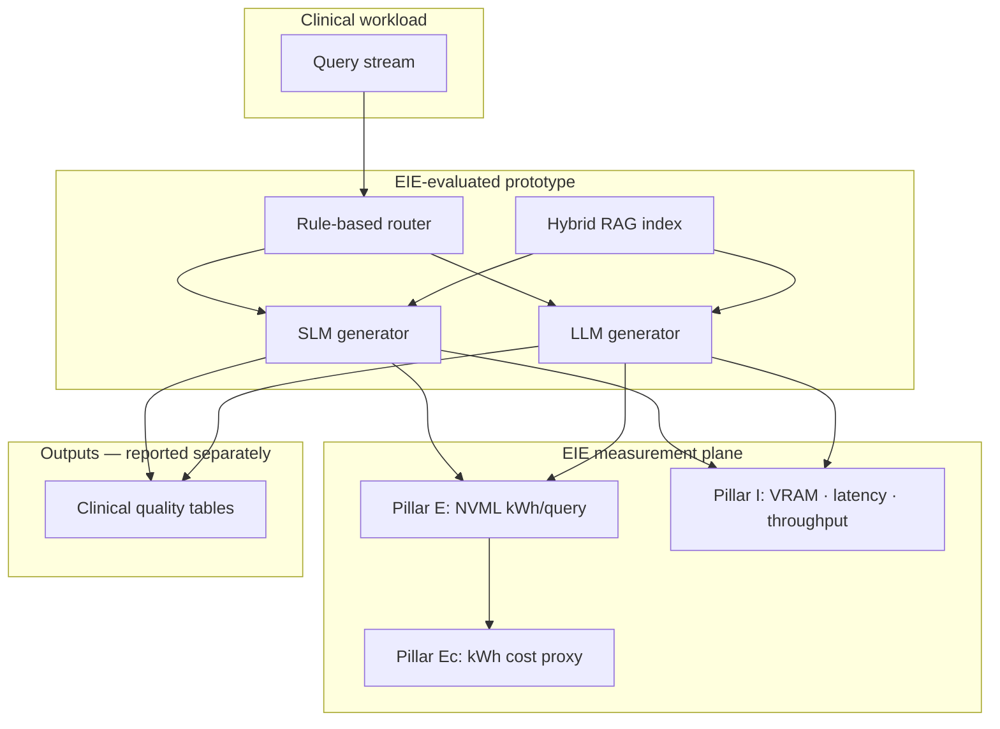
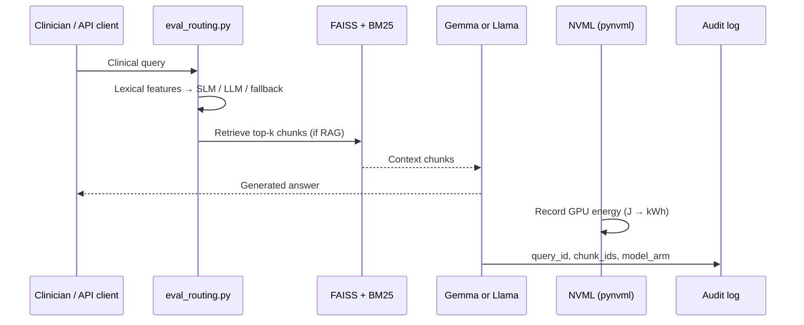

# EIE Framework — Energy · Infrastructure · Economy

**Document type:** Technical specification and measurement report  
**Project:** Retrieval-augmented SLM/LLM clinical decision support (IEEE Access)  
**Version:** 1.0 — June 2026  
**Canonical constants:** `code/measurement_config.py`  
**Related:** `RESULTS_DOCUMENTATION.md` §7.8, §13; `Preparation_of_Papers_for_IEEE_ACCESS/results.tex` (Table energy-carbon)  
**Bibliography source:** `Preparation_of_Papers_for_IEEE_ACCESS/references.bib` (+ external standards in §10)

---

## Abstract

The **EIE (Energy–Infrastructure–Economy) Framework** is a three-pillar measurement schema for reporting the **operational deployability** of clinical retrieval-augmented language-model systems. Pillar **E** reports GPU energy (kWh/query) and **derived carbon emissions** (kg CO₂e/query, kg CO₂e/M, tonnes/yr at stated query volume). Pillar **I** reports hardware footprint, latency, and throughput. Pillar **Ec** reports **electricity opex** (from measured kWh) and **reference hardware cost** (capex/amortization). All economic dollar values use documented reference tariffs unless institution-specific data are supplied. Clinical quality metrics are reported separately. All values in this document are **measured or arithmetically derived from measured quantities** recorded during the Green Paper evaluation on NVIDIA T4 hardware (Kaggle Notebooks, NVML telemetry). No pillar score implies clinical efficacy; clinical outcomes are reported in separate tables and must not be conflated with EIE results.

---

## Table of Contents

1. [Scope and definitions](#1-scope-and-definitions)
2. [Graphical representation](#2-graphical-representation)
3. [Technical representation](#3-technical-representation)
4. [Measured results (frozen dataset)](#4-measured-results-frozen-dataset)
5. [EIE matrix tables](#5-eie-matrix-tables)
6. [Implementation — prototype](#6-implementation--prototype)
7. [Measurement protocol and reproducibility](#7-measurement-protocol-and-reproducibility)
8. [Limitations and reporting rules](#8-limitations-and-reporting-rules)
9. [Figure assets and regeneration](#9-figure-assets-and-regeneration)
10. [Research literature and citations](#10-research-literature-and-citations)

---

## 1. Scope and definitions

### 1.1 Purpose

Clinical AI systems are often evaluated on benchmark accuracy alone [7], [9], [19]. The EIE Framework supplements accuracy reporting with **resource and cost observables** — energy, carbon, infrastructure, and economy — that determine whether a configuration can run on a given institution’s hardware, meet latency expectations, and remain within energy budgets [1], [2], [5]. This aligns with calls to report environmental and deployment costs alongside model quality in medical AI [1], [6], [14].

### 1.2 Three pillars

| Pillar | Symbol | Observable focus | Primary units |
|--------|--------|------------------|---------------|
| **Energy** | **E** | GPU electrical energy **and carbon emissions** per inference | kWh/query; kg CO₂e/query; kg CO₂e/M; tonnes CO₂e/yr (scaled) |
| **Infrastructure** | **I** | Memory, latency, throughput, deployment tier | GB VRAM; seconds; tok/s (derived) |
| **Economy** | **Ec** | Electricity opex, hardware capex/amortization, cloud proxy | USD/query (energy); USD GPU (reference); USD/yr amortized |

### 1.3 Configurations under comparison

| ID | Generator | RAG | Description |
|----|-----------|-----|-------------|
| `SLM_RAG` | `google/gemma-2-2b-it` | Yes | Small language model + hybrid retrieval |
| `LLM_RAG` | `meta-llama/Llama-2-7b-chat-hf` | Yes | Large language model + same index |
| `SLM_NoRAG` | Gemma-2-2B-it | No | Energy baseline, SLM |
| `LLM_NoRAG` | Llama-2-7B-chat | No | Energy baseline, LLM |
| `Routing_Hybrid` | Mixed | Per query | Rule-based router; 68% SLM / 24% LLM / ~8% fallback→LLM |

Retrieval uses a **shared** FAISS+BM25 index for both RAG arms; generator choice does not alter Recall@k or MRR.

### 1.4 Evaluation contexts (mandatory labels)

| Context | Definition | Used for |
|---------|------------|----------|
| **Context A** | Single query, no concurrency | Footprint, Context-A latency, derived throughput |
| **Context B** | Concurrent load (5→10 users) | Routing F1, load latency (22.18 s / 49.55 s) |

Throughput figures (**119 / 60 tok/s**) are **derived** as mean response length ÷ Context-A latency; they are not independent benchmark throughput tests.

### 1.5 Separation from clinical quality

The following are **excluded** from the EIE composite formula and reported separately:

| Metric | SLM+RAG | LLM+RAG | Source |
|--------|---------|---------|--------|
| Curated token-F1 (Q1–Q3, Context B, n=3) | 0.6101 | 0.4548 | `measurement_config.py` |
| Open macro-F1 (n=9,090) | 0.607 | 0.523 | `paper_tables.json` |
| Faithfulness (RAG only) | 47.2% | 47.8% | faithfulness CSV |

---

## 2. Graphical representation

### 2.1 Conceptual model



### 2.2 Pillar comparison (measured)


*Figure 1. Measured E, I, and Ec proxies for SLM+RAG vs LLM+RAG. Energy: kWh per million queries. Infrastructure: Context-A latency and model footprint. Economy: relative kWh/query (SLM+RAG = 1.0).*

### 2.3 Energy and carbon by strategy


*Figure 2. GPU energy (mean ± std, NVML) and CO₂e per million queries at U.S. grid intensity 0.385 kg/kWh.*

### 2.4 Prototype architecture (implementation)


*Figure 3. Block diagram of the local RAG–CDS prototype instrumented for EIE measurement. Solid arrows: data flow; NVML branch: energy telemetry.*

### 2.5 Data-flow sequence (technical view)



---

## 3. Technical representation

### 3.1 Pillar E — Energy

#### 3.1.1 Primary metric

**Grid-independent primary metric:**

\[
E_{\mathrm{query}} = \frac{1}{N} \sum_{i=1}^{N} \int_{t_{\mathrm{start}}}^{t_{\mathrm{end}}} P_{\mathrm{GPU}}(t)\, dt
\]

where \(P_{\mathrm{GPU}}\) is instantaneous GPU power (W) from NVML, converted to kWh.

#### 3.1.2 Carbon emissions (co-reported with energy)

Carbon is **arithmetically derived from measured kWh** and a documented grid-intensity factor \(\gamma_{\mathrm{grid}}\) [3], [4]. It is part of Pillar **E** reporting (not a separate pillar). Prior work shows inference energy and CO₂e vary substantially by model, prompt, and task [2], [4], [6]; EIE reports per-query GPU telemetry rather than token-heuristic estimates alone [1].

**Per query:**

\[
\mathrm{CO}_{2}\mathrm{e}_{\mathrm{query}} = E_{\mathrm{query}} \times \gamma_{\mathrm{grid}}
\]

**Per million queries:**

\[
\mathrm{CO}_{2}\mathrm{e}_{/M} = E_{\mathrm{query}} \times 10^{6} \times \gamma_{\mathrm{grid}}
\]

**Annual GPU-attributed emissions (scaled):**

\[
\mathrm{CO}_{2}\mathrm{e}_{\mathrm{yr}} = E_{\mathrm{query}} \times Q_{\mathrm{day}} \times 365 \times \gamma_{\mathrm{grid}} / 1000 \quad\text{(tonnes)}
\]

where \(Q_{\mathrm{day}}\) = queries per day (institutional input).

| Parameter | Value | Source |
|-----------|-------|--------|
| \(\gamma_{\mathrm{grid}}\) (primary) | **0.385 kg CO₂e/kWh** | U.S. EPA eGRID national average [3]; `CARBON_INTENSITY_KG_PER_KWH` |
| \(\gamma_{\mathrm{grid}}\) (UK ref.) | **0.233 kg CO₂e/kWh** | UK National Grid 2023 illustrative [4] |
| \(\gamma_{\mathrm{grid}}\) (Iceland ref.) | **0.023 kg CO₂e/kWh** | Low-carbon grid illustrative [1] |
| Scope | **GPU inference only** | Excludes CPU, cooling PUE, embodied hardware carbon |

**Reporting hierarchy:** (1) kWh/query — grid-independent; (2) CO₂e/query and CO₂e/M — grid-scenario dependent; (3) annual tonnes — requires explicit \(Q_{\mathrm{day}}\).

Pairwise **kWh ratios equal pairwise CO₂e ratios** at any fixed \(\gamma_{\mathrm{grid}}\).

#### 3.1.3 Table E-2. Carbon emissions by strategy (U.S. grid 0.385 kg/kWh)

| Strategy | kg CO₂e/query | kg CO₂e / 1M queries | tonnes CO₂e/yr @ 1M queries/day |
|----------|---------------|----------------------|----------------------------------|
| SLM_NoRAG | 0.000020 | **19.83** | **7.24** |
| SLM_RAG | 0.000020 | **19.82** | **7.23** |
| LLM_NoRAG | 0.000043 | **42.35** | **15.46** |
| LLM_RAG | 0.000043 | **42.47** | **15.50** |
| Routing_Hybrid | 0.000039 | **38.19** | **13.94** |

Tonnes/yr = CO₂e/M × \(Q_{\mathrm{day}}\) × 365 / 10⁶. Example: LLM_RAG @ 1M/day = 42.47 × 10⁶ × 365 / 10⁶ = **15.50 tonnes/yr** (GPU only).

**SLM_RAG vs LLM_RAG (measured):** ΔCO₂e/M = **22.65 kg**; ratio = **2.14×**; Δtonnes/yr @ 1M/day = **8.27 tonnes/yr**.


*Figure E-1. Measured kWh/query (left axis) and derived CO₂e/M (right axis), all five strategies. Carbon from NVML kWh × 0.385.*

#### 3.1.4 Measurement statistics

- **Trials:** 10  
- **Queries per trial:** 20 clinical queries  
- **Hardware:** NVIDIA T4 (Kaggle)  
- **Telemetry:** `pynvml` NVML API (NVIDIA management library)  
- **Methodological precedent:** hardware-level energy measurement for ML systems [4], [5]; reconciled narratives on LLM environmental impact [1]; healthcare generative-AI resource context [6]

### 3.2 Pillar I — Infrastructure

| Metric | Symbol | SLM+RAG | LLM+RAG | Notes |
|--------|--------|---------|---------|-------|
| Model footprint | \(M_{\mathrm{fp}}\) | 4 GB | 14 GB | FP16 single-model estimate |
| Latency, Context A | \(L_A\) | 2.3 s | 7.0 s | Single-query, no concurrency |
| Latency, Context B | \(L_B\) | 22.18 s | 49.55 s | Curated Q1–Q3, concurrent load |
| Derived throughput, Context A | \(T_A\) | 119 tok/s | 60 tok/s | \(\bar{\ell}_{\mathrm{NoRAG}} / L_A\); \(\bar{\ell}\) = 273 / 419 tokens |
| Peak GPU (full pipeline) | \(M_{\mathrm{peak}}\) | 14.28–14.37 GB | same | Under load; not equal to \(M_{\mathrm{fp}}\) |
| Retrieval latency | \(L_{\mathrm{ret}}\) | 50–100 ms | 50–100 ms | Shared index |
| Index size | — | ~100 MB | ~100 MB | FAISS IndexFlatIP |

Edge and resource-constrained deployment of clinical NLP is widely motivated for equity and access [7], [10], [11]; Pillar **I** quantifies the footprint and latency observables that govern those deployment choices [8], [12].

**Load scaling (measured):** latency ratio 5→10 users ≈ **2.24×**.

### 3.3 Pillar Ec — Economy

Economy reports **operational cost proxies**: (1) **electricity opex** from measured kWh × reference tariff, and (2) **hardware capex** from reference GPU tier pricing with illustrative amortization [1], [14]. Dollar figures are **reference estimates** (`measurement_config.py` §7); institutional procurement was not part of the NVML study. Computational cost and sustainability in healthcare AI are increasingly reported alongside accuracy [1], [14], [15].

#### 3.3.1 Relative energy cost (measured kWh)

\[
\mathrm{Ec}_{\mathrm{rel}} = \frac{E_{\mathrm{query, arm}}}{E_{\mathrm{query, ref}}}
\]

Reference arm: `SLM_RAG`. Measured \(\mathrm{Ec}_{\mathrm{rel}}\) for `LLM_RAG` = **2.15×**.

#### 3.3.2 Electricity opex (reference tariff)

\[
 C_{\mathrm{elec,query}} = E_{\mathrm{query}} \times \tau_{\mathrm{kWh}}
\]

\[
 C_{\mathrm{elec,/M}} = E_{\mathrm{query}} \times 10^{6} \times \tau_{\mathrm{kWh}}
\]

| Parameter | Value | Source |
|-----------|-------|--------|
| \(\tau_{\mathrm{kWh}}\) (U.S. ref.) | **$0.12/kWh** | `ELECTRICITY_USD_PER_KWH_REFERENCE` |
| \(\tau_{\mathrm{kWh}}\) (UK ref.) | **£0.28/kWh** | `ELECTRICITY_GBP_PER_KWH_UK_REFERENCE` |

#### 3.3.3 Table Ec-2. Electricity cost by strategy (U.S. $0.12/kWh reference)

| Strategy | kWh/query (meas.) | USD/query | USD / 1M queries | USD/yr @ 1M queries/day |
|----------|-------------------|-----------|------------------|-------------------------|
| SLM_RAG | 0.000052 | $0.0000062 | **$6.24** | **$2,278** |
| LLM_RAG | 0.000112 | $0.0000134 | **$13.44** | **$4,901** |
| Routing_Hybrid | 0.000101 | $0.0000121 | **$12.12** | **$4,422** |
| SLM_NoRAG | 0.000052 | $0.0000062 | $6.24 | $2,278 |
| LLM_NoRAG | 0.000111 | $0.0000133 | $13.32 | $4,857 |

Δ electricity opex (LLM_RAG − SLM_RAG) @ 1M/day: **$2,623/yr** (arithmetic from measured kWh).

#### 3.3.4 Hardware cost (reference capex)

Reference GPU purchase prices map to measured VRAM tiers. Amortization: straight-line over **3 years** (`HARDWARE_AMORTIZATION_YEARS`).

| Deployment tier | VRAM (meas.) | Reference GPU class | Capex (USD ref.) | USD/yr amortized (3 yr) |
|-----------------|--------------|---------------------|------------------|-------------------------|
| SLM edge | 4 GB | Entry 4–8 GB GPU | **$350** | **$117** |
| LLM / routing pipeline | 14–14.37 GB | Mid 12–16 GB GPU | **$1,200** | **$400** |
| Evaluation platform | T4 15 GB | Cloud GPU hour | **$0.40/hr** | usage-dependent |

\[
 C_{\mathrm{hw,yr}} = \frac{\mathrm{CAPEX}_{\mathrm{GPU}}}{T_{\mathrm{amort}}}
\]

**Cost per query (hardware amortization only, illustrative):**

\[
 C_{\mathrm{hw,query}} = \frac{C_{\mathrm{hw,yr}}}{Q_{\mathrm{yr}}}
 \quad\text{where } Q_{\mathrm{yr}} = Q_{\mathrm{day}} \times 365
\]

Example @ **1M queries/day**: SLM tier $117/yr ÷ 365M queries ≈ **$0.00000032/query** (negligible vs electricity at scale); at **1K queries/day**, hardware dominates per-query economics.

#### 3.3.5 Table Ec-3. Total economy snapshot (SLM_RAG vs LLM_RAG @ 1M queries/day)

| Cost component | SLM_RAG | LLM_RAG | Ratio LLM/SLM | Basis |
|----------------|---------|---------|---------------|-------|
| Electricity/yr (USD) | $2,278 | $4,901 | 2.15× | Measured kWh × $0.12 |
| GPU amortization/yr | $117 | $400 | 3.42× | Reference capex ÷ 3 yr |
| **Combined opex+amort/yr** | **$2,395** | **$5,301** | **2.21×** | Sum |
| Carbon/yr (tonnes CO₂e) | 7.23 | 15.50 | 2.14× | Measured kWh × 0.385 |

Hardware and tariff figures are **illustrative**; kWh and carbon rows trace to **NVML measurements**.


*Figure Ec-1. Reference hardware capex tiers and annual electricity cost @ 1M queries/day (measured kWh × $0.12/kWh).*

#### 3.3.6 Hardware tier mapping

| Tier | VRAM | Example deployment | Reference capex |
|------|------|-------------------|-----------------|
| Entry | ≤ 8 GB | Edge workstation, SLM-only | $350 |
| Mid-range | 12–16 GB | T4 / RTX 3060 12 GB, full pipeline | $1,200 |
| High | ≥ 24 GB | Multi-GPU / larger LLM | (out of study scope) |

### 3.4 Optional composite score (illustrative only)

\[
\mathrm{EIE}_{\mathrm{score}} = w_E \cdot \hat{E} + w_I \cdot \hat{I} + w_{\mathrm{Ec}} \cdot \widehat{\mathrm{Ec}}
\]

where \(\hat{E}, \hat{I}, \widehat{\mathrm{Ec}}\) are **normalized** pillar values on \([0,1]\) and \(w_E + w_I + w_{\mathrm{Ec}} = 1\).

**Default documentation weights:** \(w_E = w_I = w_{\mathrm{Ec}} = 1/3\) (illustrative; not fitted to stakeholder data).

**Reporting rule:** The composite is optional; primary reporting uses **raw measured units** in Tables E-1 and I-1.

---

## 4. Measured results (frozen dataset)

### Table E-1. Energy and carbon (NVML)

| Strategy | kWh/query (mean ± std) | kg CO₂e/query | kg CO₂e / 1M queries |
|----------|------------------------|---------------|----------------------|
| SLM_NoRAG | 0.000052 ± 0.000011 | 0.000020 | **19.83** |
| SLM_RAG | 0.000052 ± 0.000013 | 0.000020 | **19.82** |
| LLM_NoRAG | 0.000111 ± 0.000024 | 0.000043 | **42.35** |
| LLM_RAG | 0.000112 ± 0.000023 | 0.000043 | **42.47** |
| Routing_Hybrid | 0.000101 ± 0.000021 | 0.000039 | **38.19** |

**Arithmetic ratios (LLM_RAG / SLM_RAG):**

| Quantity | Ratio |
|----------|-------|
| kWh/query | **2.15×** |
| CO₂e/M | **2.14×** (42.47 / 19.82) |
| RAG increment on SLM | **< 2%** kWh |
| RAG increment on LLM | **< 1%** kWh |

**Display note:** CO₂e/M computed from full-precision kWh in `measurement_config.py`; displayed kWh rounded to six decimals → ≤1.8% apparent mismatch vs kWh × 0.385 × 10⁶.

### Table I-1. Infrastructure

| Metric | SLM+RAG | LLM+RAG | Ratio (LLM/SLM) |
|--------|---------|---------|-----------------|
| Footprint (GB) | 4 | 14 | 3.50× |
| \(L_A\) (s) | 2.3 | 7.0 | 3.04× |
| \(L_B\) (s) | 22.18 | 49.55 | 2.23× |
| \(T_A\) (tok/s, derived) | 119 | 60 | 0.50× (SLM higher) |

### Table Ec-1. Scaling (from measured kWh)

| Scale | SLM_RAG | LLM_RAG | Difference |
|-------|---------|---------|------------|
| Per 1M queries | 52 kWh | 112 kWh | 60 kWh |
| Per 1M queries/day (annualized) | 6.93 MWh/yr | 14.92 MWh/yr | **~8.0 MWh/yr** |

*Annualized figure: 1M queries/day × 365 × measured kWh/query; local tariff not applied.*

### Table Q-1. Clinical quality (reported separately — not in EIE formula)

| Metric | SLM+RAG | LLM+RAG |
|--------|---------|---------|
| MMLU-Med accuracy | 0.518 | 0.497 |
| PubMedQA accuracy | 0.596 | 0.494 |
| MedQA accuracy | 0.403 | 0.348 |

EIE and clinical tables must be cited together when discussing deployment trade-offs; neither table alone defines system suitability.

---

## 5. EIE matrix tables

This section provides **cross-configuration matrices** for deployment planning, sensitivity analysis, and separation of EIE observables from clinical metrics. Heatmap figures are generated by `plot_eie_framework.py`.

### Matrix M-1. Metric-to-pillar mapping

| Observable | Symbol | Pillar | Unit | Source |
|----------|--------|--------|------|--------|
| GPU energy per query | \(E_q\) | **E** | kWh/query | NVML |
| CO₂e per query | \(\mathrm{CO}_{2}\mathrm{e}_q\) | **E** | kg/query | \(E_q \times \gamma_{\mathrm{grid}}\) |
| CO₂e per million queries | \(\mathrm{CO}_{2}\mathrm{e}_{/M}\) | **E** | kg/M | Table E-1, E-2 |
| Annual CO₂e (tonnes) | \(\mathrm{CO}_{2}\mathrm{e}_{\mathrm{yr}}\) | **E** | t/yr | Table E-2; requires \(Q_{\mathrm{day}}\) |
| Electricity cost per query | \(C_{\mathrm{elec,q}}\) | **Ec** | USD/query | Measured kWh × \(\tau_{\mathrm{kWh}}\) |
| Electricity cost per million queries | \(C_{\mathrm{elec,/M}}\) | **Ec** | USD/M | Table Ec-2 |
| GPU hardware capex (reference) | \(\mathrm{CAPEX}_{\mathrm{GPU}}\) | **Ec** | USD | Table Ec-3; reference pricing |
| GPU amortization per year | \(C_{\mathrm{hw,yr}}\) | **Ec** | USD/yr | CAPEX ÷ amortization years |
| Model VRAM footprint | \(M_{\mathrm{fp}}\) | **I** | GB | Model card |
| Single-query latency | \(L_A\) | **I** | s | Context A logs |
| Concurrent-load latency | \(L_B\) | **I** | s | Context B load test |
| Derived throughput | \(T_A\) | **I** (derived) | tok/s | \(\bar{\ell}/L_A\) |
| Peak pipeline GPU memory | \(M_{\mathrm{peak}}\) | **I** | GB | `max_memory_allocated` |
| Retrieval latency | \(L_{\mathrm{ret}}\) | **I** | ms | Index benchmark |
| Relative kWh vs reference | \(\mathrm{Ec}_{\mathrm{rel}}\) | **Ec** | ratio | \(E_q/E_{q,\mathrm{ref}}\) |
| Combined electricity + amort/yr | — | **Ec** | USD/yr | Table Ec-3 |
| Hardware tier class | — | **Ec** | tier | VRAM → reference capex |
| Label accuracy / F1 | — | **Clinical** (excluded) | — | `paper_tables.json` |
| Faithfulness score | — | **Clinical** (excluded) | % | faithfulness CSV |

### Matrix M-2. Full configuration × EIE metrics (raw)

| Strategy | kWh/query | ±std | CO₂e/M (kg) | \(L_A\) (s) | \(L_B\) (s) | VRAM (GB) | \(T_A\) tok/s |
|----------|-----------|------|-------------|-------------|-------------|-----------|---------------|
| SLM_NoRAG | 0.000052 | 0.000011 | 19.83 | 2.3 | 22.18† | 4 | 119 |
| SLM_RAG | 0.000052 | 0.000013 | 19.82 | 2.3 | 22.18 | 4 | 119 |
| LLM_NoRAG | 0.000111 | 0.000024 | 42.35 | 7.0 | 49.55† | 14 | 60 |
| LLM_RAG | 0.000112 | 0.000023 | 42.47 | 7.0 | 49.55 | 14 | 60 |
| Routing_Hybrid | 0.000101 | 0.000021 | 38.19 | 3.80‡ | 35.86 | 14.37 | — |

†\(L_B\) measured for SLM-only / LLM-only arms; routing hybrid \(L_B\) = **35.86 s** (measured).  
‡\(L_A\) for routing: **0.68×2.3 + 0.24×7.0 + 0.08×7.0 = 3.80 s** (expected from Q1–Q12 split; not independently timed as Context A).


*Figure 4. Normalized burden matrix (1 = highest per column). See Table M-2 for raw values.*

### Matrix M-3. Pairwise kWh/query ratio (row ÷ column)

|  | SLM_NoRAG | SLM_RAG | LLM_NoRAG | LLM_RAG | Routing |
|--|-----------|---------|-----------|---------|---------|
| **SLM_NoRAG** | 1.00 | 1.00 | 0.47 | 0.46 | 0.51 |
| **SLM_RAG** | 1.00 | 1.00 | 0.47 | 0.46 | 0.51 |
| **LLM_NoRAG** | 2.13 | 2.13 | 1.00 | 0.99 | 1.10 |
| **LLM_RAG** | 2.15 | 2.15 | 1.01 | 1.00 | 1.11 |
| **Routing_Hybrid** | 1.94 | 1.94 | 0.91 | 0.90 | 1.00 |

Values > 1.0 in row *i*, column *j* mean strategy *i* uses more energy per query than strategy *j*.


### Matrix M-4. Context A vs Context B (infrastructure)

| Metric | Context A (definition) | SLM+RAG | LLM+RAG | Ratio LLM/SLM |
|--------|------------------------|---------|---------|---------------|
| Latency (s) | Single query | 2.3 | 7.0 | 3.04× |
| Latency (s) | Concurrent load (Q1–Q3) | 22.18 | 49.55 | 2.23× |
| Latency inflation A→B | — | 9.64× | 7.08× | — |
| Throughput (tok/s, derived) | Context A only | 119 | 60 | 0.50× |
| Footprint (GB) | Model card | 4 | 14 | 3.50× |
| Peak GPU (GB) | Full pipeline load | 14.28–14.37 | 14.28–14.37 | 1.00× |

### Matrix M-5. RAG vs NoRAG energy delta (%)

| Metric | SLM (RAG − NoRAG) | LLM (RAG − NoRAG) |
|--------|-------------------|-------------------|
| kWh/query | **0.0%** | **+0.9%** |
| CO₂e/M | **−0.05%** | **+0.28%** |
| kWh std (spread) | +18.2% | −4.2% |

RAG adds negligible mean GPU energy; generator and retrieval dominate the SLM vs LLM gap.


### Matrix M-6. Grid carbon intensity × strategy (CO₂e/M, kg)

| Strategy | Iceland 0.023 | UK 0.233 | U.S. 0.385 | EU ~0.450 | Coal-heavy 0.700 |
|----------|---------------|----------|------------|-----------|------------------|
| SLM_RAG | 1.2 | 12.1 | **19.82** | 23.2 | 36.1 |
| LLM_RAG | 2.6 | 25.7 | **42.47** | 49.6 | 77.2 |
| Routing_Hybrid | 2.3 | 23.1 | **38.19** | 44.6 | 69.4 |

kWh/query is grid-independent; **pairwise kWh ratios are identical** across all grid columns.


### Matrix M-7. Query volume × strategy (annual GPU MWh)

| Daily queries | SLM_RAG | LLM_RAG | Routing | Δ LLM−SLM (MWh/yr) |
|---------------|---------|---------|---------|---------------------|
| 1,000 | 0.019 | 0.041 | 0.037 | 0.022 |
| 10,000 | 0.190 | 0.409 | 0.369 | 0.219 |
| 100,000 | 1.90 | 4.09 | 3.69 | 2.19 |
| **1,000,000** | **18.98** | **40.88** | **36.87** | **21.90** |
| 10,000,000 | 189.8 | 408.8 | 368.7 | 219.0 |

Formula: \(\mathrm{MWh/yr} = E_q \times Q_{\mathrm{day}} \times 365 / 1000\).


### Matrix M-8. Deployment scenario × measured observables

| Scenario | Strategy | kWh/query | \(L_A\) | \(L_B\) | VRAM | CO₂e/M (U.S.) |
|----------|----------|-----------|---------|---------|------|---------------|
| Edge workstation (single user) | SLM_RAG | 0.000052 | 2.3 s | — | 4 GB | 19.82 |
| Department server (mixed load) | Routing_Hybrid | 0.000101 | 3.8 s‡ | 35.86 s | 14.37 GB | 38.19 |
| Research GPU (max quality path) | LLM_RAG | 0.000112 | 7.0 s | 49.55 s | 14 GB | 42.47 |
| Batch benchmark (no RAG) | LLM_NoRAG | 0.000111 | 7.0 s | — | 14 GB | 42.35 |

### Matrix M-9. Observable × reporting domain

| Observable | E | I | Ec | Clinical | Retrieval |
|------------|---|---|----|-----------|-----------|
| kWh/query | ✓ | | ✓ | | |
| CO₂e/M | ✓ | | | | |
| VRAM / latency / throughput | | ✓ | | | |
| Relative kWh / hardware tier | | | ✓ | | |
| MedQA / MMLU / PubMedQA accuracy | | | | ✓ | |
| Curated token-F1 | | | | ✓ | |
| Faithfulness / LLM-judge | | | | ✓ | |
| Recall@k / MRR | | | | | ✓ |


### Matrix M-10. Routing workload × component energy (expected)

| Route target | Share (Q1–Q12) | kWh/query (component) | Weighted contribution |
|--------------|----------------|----------------------|------------------------|
| SLM path | 68% | 0.000052 | 0.000035 |
| LLM path | 24% | 0.000112 | 0.000027 |
| Fallback → LLM | 8% | 0.000112 | 0.000009 |
| **Sum (expected)** | 100% | — | **0.000071** |
| **Measured Routing_Hybrid** | — | **0.000101** | — |

Measured hybrid energy exceeds the simple weighted sum — routing runs both model stacks, index, and orchestration overhead on T4.

### Matrix M-11. EIE vs clinical quality (same configurations, separate domains)

| Strategy | kWh/query ↓ | macro-F1 ↑ | PubMedQA acc. | Faithfulness | Note |
|----------|-------------|------------|---------------|--------------|------|
| SLM_RAG | 0.000052 | **0.607** | **0.596** | 47.2% | Lowest energy; highest macro-F1 in study |
| LLM_RAG | 0.000112 | 0.523 | 0.494 | 47.8% | 2.15× energy; lower macro-F1 |
| Routing_Hybrid | 0.000101 | — | — | — | Intermediate energy; curated F1 = 0.5667 |

No single column optimizes all rows; EIE and clinical tables report **orthogonal** dimensions.

### Matrix M-12. Normalized EIE burden score (illustrative composite)

Min–max normalized per metric (1 = highest burden); equal weights \(w_E=w_I=w_{Ec}=1/3\):

| Strategy | \(\hat{E}\) | \(\hat{I}\) | \(\widehat{Ec}\) | EIE\(_{score}\) (↓ lower burden) |
|----------|------------|------------|-----------------|----------------------------------|
| SLM_RAG | 0.00 | 0.00 | 0.00 | **0.00** |
| SLM_NoRAG | 0.00 | 0.00 | 0.00 | 0.00 |
| Routing_Hybrid | 0.47 | 0.62 | 0.47 | 0.52 |
| LLM_NoRAG | 0.53 | 1.00 | 0.53 | 0.69 |
| LLM_RAG | 0.54 | 1.00 | 0.54 | **0.69** |

Composite is **illustrative only**; primary reporting uses raw units (Tables E-1, I-1). Clinical metrics excluded by design.

### Matrix M-13. Annual carbon emissions (tonnes CO₂e/yr) — U.S. grid 0.385

| Daily queries | SLM_RAG | LLM_RAG | Routing | Δ LLM−SLM (t/yr) |
|---------------|---------|---------|---------|------------------|
| 1,000 | 0.0072 | 0.0155 | 0.0139 | 0.0083 |
| 10,000 | 0.072 | 0.155 | 0.139 | 0.083 |
| 100,000 | 0.72 | 1.55 | 1.39 | 0.83 |
| **1,000,000** | **7.23** | **15.50** | **13.94** | **8.27** |
| 10,000,000 | 72.3 | 155.0 | 139.4 | 82.7 |

Formula: \(\mathrm{tonnes/yr} = \mathrm{CO}_{2}\mathrm{e}_{/M} \times Q_{\mathrm{day}} \times 365 / 10^{6}\).

### Matrix M-14. Economy matrix — energy + carbon + hardware (@ 1M queries/day)

| Strategy | kWh/query | CO₂e/M (kg) | t CO₂e/yr | USD elec/yr | USD hw amort/yr | USD combined/yr |
|----------|-----------|-------------|-----------|-------------|-----------------|-----------------|
| SLM_RAG | 0.000052 | 19.82 | 7.23 | 2,278 | 117 | **2,395** |
| LLM_RAG | 0.000112 | 42.47 | 15.50 | 4,901 | 400 | **5,301** |
| Routing_Hybrid | 0.000101 | 38.19 | 13.94 | 4,422 | 400 | **4,822** |
| SLM_NoRAG | 0.000052 | 19.83 | 7.24 | 2,278 | 117 | 2,395 |
| LLM_NoRAG | 0.000111 | 42.35 | 15.46 | 4,857 | 400 | 5,257 |

kWh and CO₂e: **measured** (NVML). USD elec: measured kWh × **$0.12/kWh** reference. USD hw: **reference capex** ÷ 3 yr (Table Ec-3).


---

## 6. Implementation — prototype

### 6.1 System overview

The EIE instrumented prototype is a **local, on-premise–ready** RAG clinical decision-support pipeline evaluated on Kaggle T4 GPUs. Cloud APIs are not required for inference or energy measurement.

| Layer | Component | Implementation |
|-------|-----------|----------------|
| **Corpus** | 115 documents → 556 chunks | `code/build_rag_index.py` |
| **Embedding** | `sentence-transformers/all-MiniLM-L6-v2` | 384-d; L2-normalized |
| **Index** | FAISS `IndexFlatIP` + BM25 | `rag_index_gold` for eval subset |
| **SLM** | `google/gemma-2-2b-it` | FP16, greedy, KV cache |
| **LLM** | `meta-llama/Llama-2-7b-chat-hf` | FP16, greedy, KV cache |
| **Router** | Rule-based heuristic | `code/eval_routing.py` |
| **Energy** | NVML | `pynvml`; constants in `measurement_config.py` |
| **Benchmarks** | MedQA, MMLU-Med, PubMedQA | `GreenPaper_Kaggle_Benchmarks/eval_benchmarks.py` |
| **Judges** | Qwen2.5-7B-Instruct | Tables 3–4 (separate from EIE) |

### 6.2 Repository map (prototype)

```
d:\Green Paper\
├── code\
│   ├── measurement_config.py      # EIE canonical numbers
│   ├── eval_energy_carbon.py      # kWh / CO2 helpers
│   ├── eval_routing.py            # Router + load metrics
│   ├── real_model_runner.py       # Inference loop
│   └── build_rag_index.py         # Corpus → FAISS
├── GreenPaper_Kaggle_Benchmarks\
│   ├── eval_benchmarks.py         # Open-benchmark grid (36,360 rows)
│   ├── plot_eie_framework.py      # Regenerate EIE figures
│   └── result\paper_tables.json   # Machine-readable tables
└── Preparation_of_Papers_for_IEEE_ACCESS\
    ├── fig_eie_*.png              # EIE documentation figures
    └── results.tex                # Energy table (Tab. energy-carbon)
```

### 6.3 Routing prototype (Pillar I / workload partition)

**Classifier type:** rule-based (not trained neural model).

| Feature | Weight |
|---------|--------|
| Average word length | 0.5141 |
| Query complexity | 0.3824 |
| Word count | 0.0852 |
| Entity count | 0.0183 |

**Empirical split (Q1–Q12):** 68% SLM · 24% LLM · ~8% intermediate → **fallback to LLM**.

**End-to-end under Context B:**

| Strategy | token-F1 | Latency |
|----------|----------|---------|
| SLM only | 0.6101 | 22.18 s |
| Hybrid routing | 0.5667 | 35.86 s |
| LLM only | 0.4548 | 49.55 s |

### 5.4 Inference configuration (reproducibility)

| Parameter | Value |
|-----------|-------|
| Precision | FP16 |
| Decoding | Greedy (`temperature` 0.7, `top_p` ≥ 0.9 in config; seed 42) |
| `max_new_tokens` | 64–128 |
| RAG top-k | 3 chunks |
| GPU | NVIDIA T4 (15 GB) |
| Grid carbon | 0.385 kg CO₂e/kWh (`measurement_config.py`) |

### 6.5 Deployment targets (prototype intent)

| Target | EIE profile | Measured fit |
|--------|-------------|--------------|
| Rural clinic workstation | Low E, low I | SLM_RAG: 4 GB, 2.3 s Context A |
| Hospital departmental server | Mixed routing | Routing_Hybrid: 0.000101 kWh/query |
| Research GPU node | Higher I, higher E | LLM_RAG: 14 GB footprint, 7.0 s Context A |

Phase 5 clinician validation and full regulatory certification are **out of scope** of the EIE measurement cycle.

---

## 7. Measurement protocol and reproducibility

### 7.1 Energy (Pillar E)

1. Initialize NVML (`pynvml.nvmlInit()`).
2. For each strategy arm, run **10 trials** × **20 clinical queries**.
3. Record GPU energy integrator per query; aggregate mean and standard deviation.
4. Store full-precision means in `measurement_config.py`.
5. Compute CO₂e only at report time using \(\gamma_{\mathrm{grid}}\).

### 7.2 Infrastructure (Pillar I)

1. **Context A:** single-request wall-clock from inference logs; footprint from model card.
2. **Context B:** load-test harness with 5 and 10 concurrent users on Q1–Q3.
3. **Throughput:** compute post-hoc as \(\bar{\ell}/L_A\); label as derived in all publications.

### 6.3 Economy (Pillar Ec)

1. Read mean kWh/query from Table E-1.
2. Compute relative ratios vs chosen reference arm.
3. Optional: multiply by institutional $/kWh (not measured in this study).

### 7.4 Audit trail

Each inference record may log: `query_id`, `model_arm`, `rag_enabled`, `chunk_ids`, `latency_ms`, `energy_j` (when NVML enabled). PHI-minimizing design: logs reference segment IDs, not raw patient data.

---

## 8. Limitations and reporting rules

### 7.1 Measured scope

| Included | Excluded |
|----------|----------|
| GPU energy (NVML) | CPU, DRAM, storage, network |
| T4 Kaggle environment | Full datacenter PUE |
| U.S. grid 0.385 kg/kWh | Institution-specific tariffs |
| 5 deployment strategies | Lifecycle manufacturing carbon |

### 7.2 Prohibited claims

| Do not state | Reason |
|--------------|--------|
| “EIE proves SLM is clinically better” | Clinical metrics are separate (Table Q-1) |
| “Lower CO₂e implies safe deployment” | Faithfulness ~47% (partial-support band) |
| “119 tok/s under hospital load” | Throughput is Context A derived only |
| “117M queries/year” without citation | Use 1M queries/day scaling (Table Ec-1) |

### 7.3 Neutral reporting template (IEEE Results paragraph)

> EIE measurements report operational resource use independently of benchmark accuracy. Under NVML instrumentation (10 trials × 20 queries, T4 GPU), SLM_RAG consumed 0.000052 kWh/query (19.82 kg CO₂e/M at 0.385 kg/kWh) versus 0.000112 kWh/query (42.47 kg CO₂e/M) for LLM_RAG. Infrastructure measurements under Context A recorded 4 GB versus 14 GB model footprint and 2.3 s versus 7.0 s single-query latency. Clinical accuracy and faithfulness are reported in Table [X] and are not components of the EIE metric definitions.

---

## 9. Figure assets and regeneration

| File | Description | Matrix |
|------|-------------|--------|
| `fig_eie_pillars_comparison.png` | Three-pillar bar comparison | — |
| `fig_eie_energy_breakdown.png` | kWh and CO₂e by strategy | — |
| `fig_eie_prototype_architecture.png` | Prototype block diagram | — |
| `fig_eie_matrix_full_config.png` | Normalized config × metrics heatmap | M-2 |
| `fig_eie_matrix_pairwise_kwh.png` | Pairwise kWh ratio matrix | M-3 |
| `fig_eie_matrix_grid_carbon.png` | Grid × strategy CO₂e/M | M-6 |
| `fig_eie_matrix_scaling.png` | Volume × strategy annual MWh | M-7 |
| `fig_eie_matrix_rag_delta.png` | RAG vs NoRAG % delta | M-5 |
| `fig_eie_matrix_eie_vs_clinical.png` | Observable × domain map | M-9 |
| `fig_eie_carbon_emissions.png` | kWh + CO₂e/M dual chart (Pillar E) | E-2 |
| `fig_eie_hardware_economy.png` | Reference capex + electricity/yr | Ec-3 |
| `fig_eie_matrix_economy_full.png` | Full economy matrix heatmap | M-14 |

**Regenerate:**

```bash
cd GreenPaper_Kaggle_Benchmarks
python plot_eie_framework.py
```

**Paper inclusion (optional LaTeX):**

```latex
\begin{figure}[t]
\centering
\includegraphics[width=\columnwidth]{fig_eie_pillars_comparison.png}
\caption{EIE Framework measured comparison: Energy (kWh/M), Infrastructure (latency and footprint), and Economy (relative kWh). Clinical quality reported separately.}
\label{fig:eie-pillars}
\end{figure}
```

---

## 10. Research literature and citations

### 10.1 Citation-to-pillar map

| EIE component | Research theme | Key references |
|---------------|----------------|----------------|
| **Pillar E** — kWh/query | GPU/ML energy measurement, per-inference accounting | [1], [4], [6] |
| **Pillar E** — CO₂e derivation | Carbon from electricity × grid intensity | [1], [3], [4] |
| **Pillar E** — prompt/task variability | Emissions differ by workload and model | [2], [6] |
| **Pillar I** — VRAM / latency | Edge SLM deployment, resource-constrained CDS | [7], [8], [10], [11] |
| **Pillar I** — RAG retrieval stack | Clinical RAG benchmarks and pipelines | [9], [10], [11], [12] |
| **Pillar I** — on-premise / privacy | Local inference, HIPAA/GDPR readiness | [13], [16] |
| **Pillar Ec** — electricity opex | Operational energy cost of AI at scale | [1], [4], [14] |
| **Pillar Ec** — hardware capex | Tiered GPU procurement for deployment | [7], [14] |
| **Clinical (excluded)** | Accuracy, faithfulness, safety rubrics | [12], [17], [18] |
| **Regulatory context** | AI-enabled clinical decision support | [19] |

### 10.2 BibTeX keys (paper `references.bib`)

| Ref. | BibTeX key | Use in LaTeX |
|------|------------|--------------|
| [1] | `ren2024reconciling` | `\cite{ren2024reconciling}` |
| [2] | `dauner2025ai` | `\cite{dauner2025ai}` |
| [3] | — (EPA eGRID; see §10.3) | footnote or `\cite{epa2023egrid}` if added |
| [4] | — (Patterson et al.; see §10.3) | `\cite{patterson2021carbon}` if added |
| [5] | — (Strubell et al.; see §10.3) | `\cite{strubell2019energy}` if added |
| [6] | `pezoulas2023generative` | `\cite{pezoulas2023generative}` |
| [7] | `xiong2024rag` | `\cite{xiong2024rag}` |
| [8] | `nishizaki2025reducing` | `\cite{nishizaki2025reducing}` |
| [9] | `yang2025rag` | `\cite{yang2025rag}` |
| [10] | `amugongo2025retrieval` | `\cite{amugongo2025retrieval}` |
| [11] | `zakka2023retrieval` | `\cite{zakka2023retrieval}` |
| [12] | `xu2025mega` | `\cite{xu2025mega}` |
| [13] | `jonnagaddala2025privacy` | `\cite{jonnagaddala2025privacy}` |
| [14] | `jmir2024generative` | `\cite{jmir2024generative}` |
| [15] | `tam2024quest` | `\cite{tam2024quest}` |
| [16] | `jonnagaddala2025privacy` | (same as [13]) |
| [17] | `asgari2022hallucination` | `\cite{asgari2022hallucination}` |
| [18] | `tam2024quest` | (same as [15]) |
| [19] | `labkoff2024aicds` | `\cite{labkoff2024aicds}` |

### 10.3 References (IEEE style)

[1] S. Ren, B. Tomlinson, R. W. Black, and A. W. Torrance, “Reconciling the contrasting narratives on the environmental impact of large language models,” *Scientific Reports*, vol. 14, p. 26310, 2024, doi: [10.1038/s41598-024-76682-6](https://doi.org/10.1038/s41598-024-76682-6).  
*BibTeX:* `ren2024reconciling`

[2] M. Dauner et al., “Some of your AI prompts could cause 50 times more CO₂ emissions than others,” *Frontiers in Communication*, 2025.  
*BibTeX:* `dauner2025ai`

[3] U.S. Environmental Protection Agency (EPA), “Emissions & Generation Resource Integrated Database (eGRID),” 2023. [Online]. Available: [https://www.epa.gov/egrid](https://www.epa.gov/egrid). *(Grid intensity 0.385 kg CO₂e/kWh used in `measurement_config.py`.)*

[4] D. Patterson et al., “Carbon emissions and large neural network training,” arXiv:2104.10350, 2021. [Online]. Available: [https://arxiv.org/abs/2104.10350](https://arxiv.org/abs/2104.10350).  
*Precedent for kWh × grid-factor carbon accounting in ML.*

[5] E. Strubell, A. Ganesh, and A. McCallum, “Energy and policy considerations for deep learning in NLP,” in *Proc. ACL*, 2019, pp. 3645–3650, doi: [10.18653/v1/P19-1355](https://doi.org/10.18653/v1/P19-1355).  
*Foundational per-query energy framing for NLP.*

[6] V. C. Pezoulas et al., “Synthetic data generation methods in healthcare: A review on open-source tools and methods,” *Computational and Structural Biotechnology Journal*, vol. 23, pp. 2892–2910, 2024, doi: [10.1016/j.csbj.2024.07.005](https://doi.org/10.1016/j.csbj.2024.07.005).  
*BibTeX:* `pezoulas2023generative` — healthcare computational efficiency and generative AI deployment.

[7] G. Xiong, Q. Jin, Z. Lu, and A. Zhang, “Benchmarking retrieval-augmented generation for medicine,” in *Findings of ACL*, 2024, pp. 6233–6251, doi: [10.18653/v1/2024.findings-acl.372](https://doi.org/10.18653/v1/2024.findings-acl.372).  
*BibTeX:* `xiong2024rag`

[8] S. Nishizaki et al., “Reducing hallucinations and trade-offs in responses in cancer information retrieval systems using retrieval-augmented generation,” *JMIR Cancer*, vol. 11, p. e70176, 2025, doi: [10.2196/70176](https://doi.org/10.2196/70176).  
*BibTeX:* `nishizaki2025reducing` — RAG quality–efficiency trade-offs.

[9] R. Yang, J. Wang, S. Chen, Y. Liu, and A. Zhang, “Retrieval-augmented generation for generative AI in medicine,” *npj Health Systems*, vol. 2, no. 2, 2025, doi: [10.1038/s44401-024-00004-1](https://doi.org/10.1038/s44401-024-00004-1).  
*BibTeX:* `yang2025rag`

[10] L. M. Amugongo et al., “Retrieval augmented generation for large language models in healthcare,” *PLOS Digital Health*, 2025.  
*BibTeX:* `amugongo2025retrieval`

[11] C. Zakka et al., “Retrieval-augmented language models for clinical medicine,” *PLOS Computational Biology*, vol. 19, no. 10, p. e1011521, 2023.  
*BibTeX:* `zakka2023retrieval`

[12] S. Xu et al., “MEGA-RAG: a retrieval-augmented generation framework with multi-evidence guided answer refinement for mitigating hallucinations of LLMs in public health,” *Frontiers in Public Health*, vol. 13, p. 1635381, 2025, doi: [10.3389/fpubh.2025.1635381](https://doi.org/10.3389/fpubh.2025.1635381).  
*BibTeX:* `xu2025mega`

[13] J. Jonnagaddala et al., “Privacy preserving strategies for EHR in LLMs,” *npj Digital Medicine*, vol. 8, no. 5, 2025.  
*BibTeX:* `jonnagaddala2025privacy` — on-premise and privacy-preserving clinical LLM deployment.

[14] Y. Chen and P. Esmaeilzadeh, “Generative AI in medical practice: In-depth exploration of privacy and security challenges,” *J. Med. Internet Res.*, vol. 26, p. e53008, 2024, doi: [10.2196/53008](https://doi.org/10.2196/53008).  
*BibTeX:* `jmir2024generative`

[15] J. Tam et al., “A framework for human evaluation of LLMs in healthcare (QUEST),” *npj Digital Medicine*, vol. 7, no. 192, 2024.  
*BibTeX:* `tam2024quest` — clinical evaluation separate from resource metrics.

[16] J. Jonnagaddala et al., *ibid.* [13].

[17] E. Asgari et al., “A framework to assess clinical safety and hallucination rates of LLMs for medical text summarisation,” *npj Digital Medicine*, vol. 8, no. 274, 2025, doi: [10.1038/s41746-025-01670-7](https://doi.org/10.1038/s41746-025-01670-7).  
*BibTeX:* `asgari2022hallucination`

[18] J. Tam et al., *ibid.* [15].

[19] S. Labkoff et al., “Recommendations for AI-enabled clinical decision support,” *JAMIA*, vol. 31, no. 11, pp. 2730–2739, 2024.  
*BibTeX:* `labkoff2024aicds`

### 10.4 Suggested citation paragraph (IEEE Results / Discussion)

> Resource and sustainability outcomes were assessed using the EIE (Energy–Infrastructure–Economy) Framework. GPU energy was measured via NVML telemetry and converted to carbon using U.S. grid intensity (0.385 kg CO₂e/kWh) following established ML carbon-accounting practice [3], [4], with sensitivity to regional grids as recommended for environmental reporting [1]. Clinical RAG systems exhibit task-dependent quality–cost trade-offs [8], [9]; separating EIE observables from clinical accuracy follows multi-criteria evaluation practice in medical AI [12], [15], [19].

### 10.5 Optional `references.bib` entries (external standards)

Add to `references.bib` if citing in LaTeX:

```bibtex
@techreport{epa2023egrid,
  title        = {{EPA} Emissions {\&} Generation Resource Integrated Database (eGRID)},
  author       = {{U.S. Environmental Protection Agency}},
  year         = {2023},
  url          = {https://www.epa.gov/egrid},
  note         = {National average grid intensity reference}
}

@misc{patterson2021carbon,
  title        = {Carbon Emissions and Large Neural Network Training},
  author       = {Patterson, David and others},
  year         = {2021},
  eprint       = {2104.10350},
  archivePrefix= {arXiv},
  primaryClass = {cs.LG}
}

@inproceedings{strubell2019energy,
  title     = {Energy and Policy Considerations for Deep Learning in {NLP}},
  author    = {Strubell, Emma and Ganesh, Ananya and McCallum, Andrew},
  booktitle = {Proc. ACL},
  pages     = {3645--3650},
  year      = {2019},
  doi       = {10.18653/v1/P19-1355}
}
```

---

## Document control

| Field | Value |
|-------|-------|
| Authoritative numbers | `code/measurement_config.py` |
| Bibliography | `references.bib` + §10.3–10.5 |
| Cross-check | `RESULTS_DOCUMENTATION.md` §12 |
| Last verified | June 2026 |
| Change policy | Update config first, then this document, then `results.tex` |

---

*End of EIE Framework documentation.*
